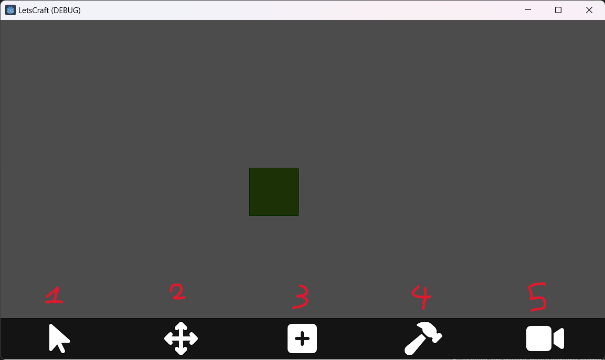
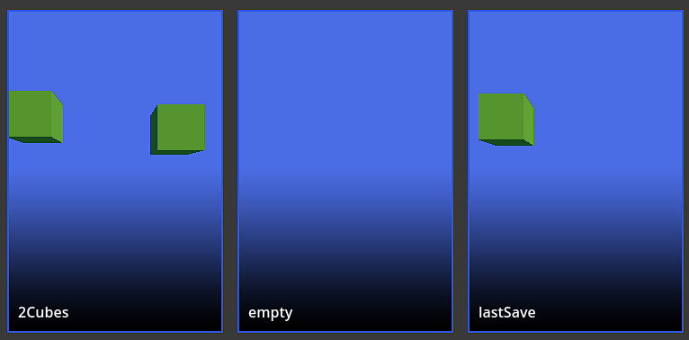

# Manuel d'utilisation

Le projet permet de créer des pièces, de les déplacer et de les sauvegarder dans un environnement en 3D.

Lorsque qu'une pièce est chargée il existe plusieurs modes :
- Mode sélection, on peut sélectionner et désélectionner les pièces en cliquant dessus
- Mode mouvement caméra, on peut déplacer la caméra autour du point d'origine avec le clic gauche et en déplaçant la souris. La molette peut être utilisée pour zoomer/dézoomer.
- Mode création, on peut créer des pièces (cube) avec le clic gauche à l'emplacement de la souris
- Mode déplacement, on peut déplacer les pièces sélectionnées en maintenant le clique et en déplacant la souris

Pour le moment, si deux pièces ce rapprochent alors elle se colleront automatiquement (une touche permet de les décoller).  

La gestion des différents modes par l'interface utilisateur.

## Interface Utilisateur

L'interface utilisateur dispose de plusieurs fonctionnalités.
- Passer en mode sélection (1)
- Passer en mode déplacement (2)
- Charger une pièce sauvegardée (3)
- Redimensionner une pièce (4)
- Passer en mode création (uniquement via commande pour le moment)
- Passer en mode mouvement caméra (5)

Voici donc à quoi ressemble l'interface lorsque l'on lance l'application. Elle sera amenée à changer plus tard dans le projet.

Une autre interface apparait si l'on décide de charger une pièce sauvegardée (il suffit de clicker dessus pour l'ajouter à votre construction en cours):

## Commandes

Sur PC, afin de faciliter la gestion des modes, même si l'UI fonctionne, il existe des raccourcis clavier pour accéder à un mode :
- `b` : Mode sélection
- `o` : Mode mouvement
- `c` : Mode création 
- `backspace` : Supprime les pièces sélectionnées
- `x` : Décole toutes les pièces sélectionnées de leur assemblage
- `ctr+s` : Sauvegarde le travail en cours (par defaut la sauvegarde s'appelle "lastSave")
- `ctr+l` : Charge la sauvegarde appeler "lastSave"  

## Bugs
Attention : l'application étant en cours de développement, certains ajouts récents peuvent présenter des bugs ou ne pas être implémenter entièrement.  
Exemple de bugs/implémentation non terminer :
- Il n'est pour l'instant possible de ne faire qu'une seul sauvegarde
- les pièces ce superposent si sauvegardées puis chargées à la suite sans les avoir déplacées entre temps
- L'UI et les commandes ne sont pas encore bien reliés et des décallages peuvent apparaître.
